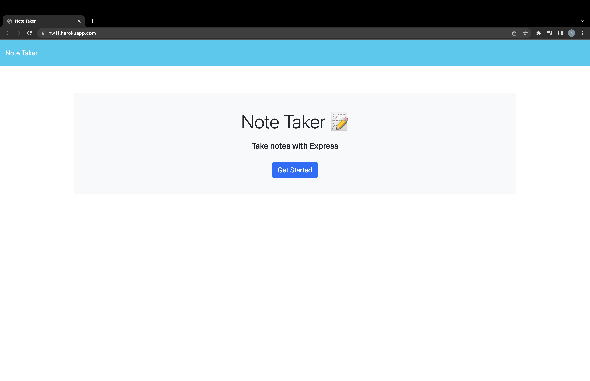

# note-taker
This application will allow the user to be able to save notes and that data remain persistently using Express.js. The user will also be able to delete the notes once they have completed the task or they no longer need the information they have saved. 

## User Story
AS A small business owner
I WANT to be able to write and save notes
SO THAT I can organize my thoughts and keep track of tasks I need to complete

## Acceptance Criteria
GIVEN a note-taking application
WHEN I open the Note Taker
THEN I am presented with a landing page with a link to a notes page
WHEN I click on the link to the notes page
THEN I am presented with a page with existing notes listed in the left-hand column, plus empty fields to enter a new note title and the note’s text in the right-hand column
WHEN I enter a new note title and the note’s text
THEN a Save icon appears in the navigation at the top of the page
WHEN I click on the Save icon
THEN the new note I have entered is saved and appears in the left-hand column with the other existing notes
WHEN I click on an existing note in the list in the left-hand column
THEN that note appears in the right-hand column
WHEN I click on the Write icon in the navigation at the top of the page
THEN I am presented with empty fields to enter a new note title and the note’s text in the right-hand column

## Installing
Clone the repository to your device. Once in the repository, run 'npm install' to install the dependencies needed for the application. You can run the application with the command 'start', and looking at localhost:3001 through the browser. The application is also hosted on Heroku below. 

## Deployed Application Links

Deployed application: https://hw11.herokuapp.com/

Git Repository: https://github.com/HunterHarvell/note-taker.git

